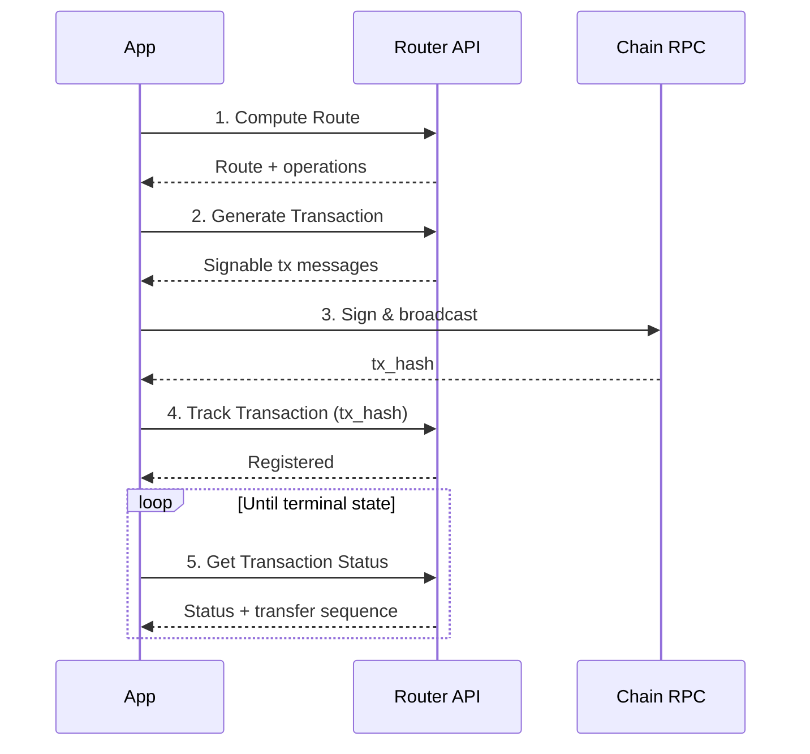

The Router API handles route computation and transaction generation, but does
not broadcast transactions. The application is responsible for signing and
submitting the transaction to the chain. This page walks through the full flow.

## Flow Overview



## Bridging Tokens

Bridging tokens between chains is a two-step process using the Routing
endpoints.

<Steps>
  <Step title="Compute a route">
    Call **Compute Route** (`POST /v2/fungible/route`) with the source and destination assets and the amount to transfer. The API evaluates available pathways (IBC, LayerZero, Optimistic bridges, etc.) and returns the optimal route, including the expected output amount and an `operations` array describing each hop.

    ```bash
    curl -X POST https://router-api.initia.xyz/v2/fungible/route \
      -H "Content-Type: application/json" \
      -d '{
        "amount_in": "1000000",
        "source_asset_chain_id": "interwoven-1",
        "source_asset_denom": "uinit",
        "dest_asset_chain_id": "8453",
        "dest_asset_denom": "0x..."
      }'
    ```

  </Step>
  <Step title="Generate transaction messages">
    Pass the route details to **Generate Transaction** (`POST /v2/fungible/msgs`) along with the relevant addresses and slippage tolerance. The API returns signable transaction messages for the source chain.

    If the route response included `required_op_hook: true`, you must first call **Get OP Hook** (`POST /op-hook`) with the source and destination addresses and assets to obtain the hook payload. Sign the hook and include it in the `signed_op_hook` field of the Generate Transaction request.

    ```bash
    curl -X POST https://router-api.initia.xyz/v2/fungible/msgs \
      -H "Content-Type: application/json" \
      -d '{
        "amount_in": "1000000",
        "amount_out": "999000",
        "source_asset_chain_id": "interwoven-1",
        "source_asset_denom": "uinit",
        "dest_asset_chain_id": "8453",
        "dest_asset_denom": "0x...",
        "address_list": ["init1abc...", "0xdef..."],
        "operations": [],
        "slippage_tolerance_percent": "1"
      }'
    ```

  </Step>
  <Step title="Sign and broadcast">
    Sign the returned transaction messages with a wallet or SDK, then broadcast to the source chain's RPC endpoint. This step happens outside the Router API.
  </Step>
</Steps>

## Tracking Transfers

Because the transaction is signed and broadcast outside the Router API's scope,
the API has no knowledge of the transaction until the application explicitly
provides the transaction hash. The transaction must be registered before its
cross-chain progress can be monitored.

<Steps>
  <Step title="Register the transaction">
    After broadcasting, call **Track Transaction** (`POST /v2/tx/track`) once with the transaction hash and the chain ID where it was submitted. This registers the transaction with the tracking service so it can begin watching for relay events and bridge confirmations across chains.

    ```bash
    curl -X POST https://router-api.initia.xyz/v2/tx/track \
      -H "Content-Type: application/json" \
      -d '{
        "tx_hash": "ABCDEF1234567890...",
        "chain_id": "interwoven-1"
      }'
    ```

  </Step>
  <Step title="Poll for status">
    Call **Get Transaction Status** (`GET /v2/tx/status`) repeatedly to check the transfer progress. The response includes the overall status and the state of each hop in the transfer sequence.

    ```bash
    curl "https://router-api.initia.xyz/v2/tx/status?tx_hash=ABCDEF1234567890...&chain_id=interwoven-1"
    ```

    Keep polling until the status reaches a terminal state such as `STATE_COMPLETED` or `STATE_FAILED`.

  </Step>
</Steps>

## Endpoint Reference

| Step | Endpoint                  | Purpose                                    |
| ---- | ------------------------- | ------------------------------------------ |
| 1    | `POST /v2/fungible/route` | Find the optimal route                     |
| 1b   | `POST /op-hook`           | Get OP hook data (when `required_op_hook`) |
| 2    | `POST /v2/fungible/msgs`  | Get signable transaction messages          |
| 3    | _(wallet/SDK)_            | Sign and broadcast to the chain            |
| 4    | `POST /v2/tx/track`       | Register the tx hash for tracking          |
| 5    | `GET /v2/tx/status`       | Poll until transfer completes              |
