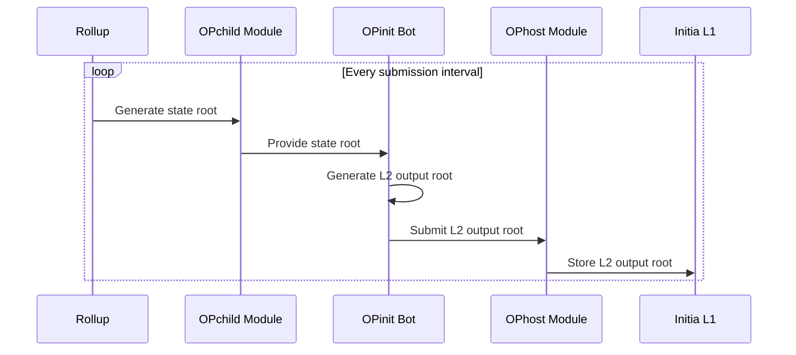

```mermaid
sequenceDiagram
    participant R as Rollup
    participant OPC as OPchild Module
    participant OPB as OPinit Bot
    participant OPH as OPhost Module
    participant IL1 as Initia L1

    loop Every submission interval
        R->>OPC: Generate state root
        OPC->>OPB: Provide state root
        OPB->>OPB: Generate L2 output root
        OPB->>OPH: Submit L2 output root
        OPH->>IL1: Store L2 output root
    end
```
