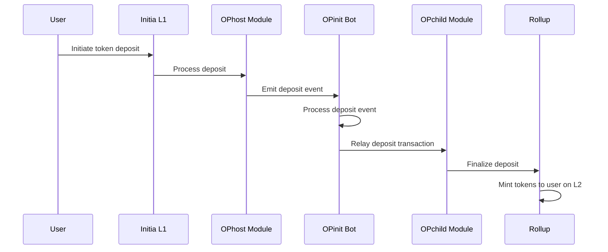
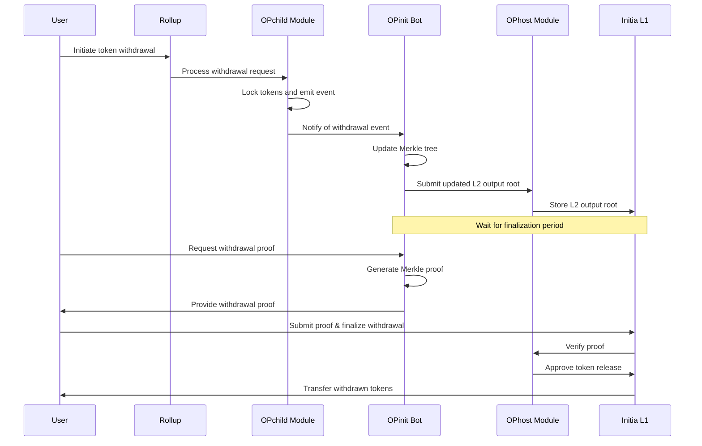
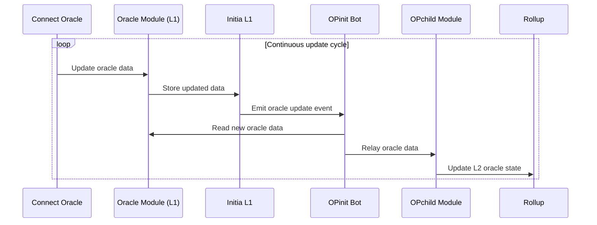
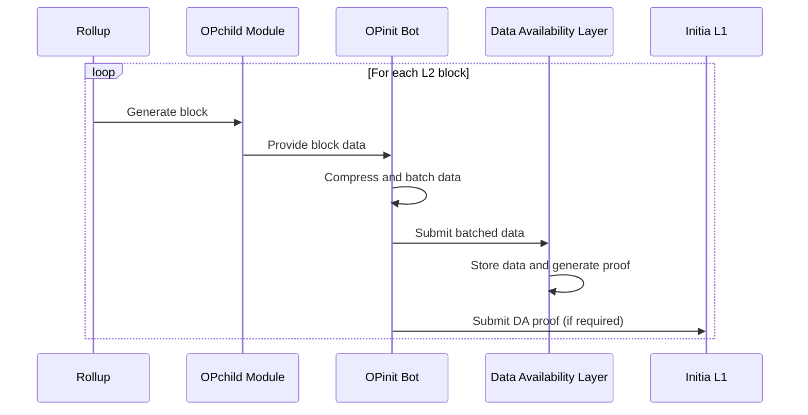

The OPinit Bot Executor is a critical component in maintaining the communication and operational integrity between the Initia L1 and rollup blockchains. It handles and automates key tasks related to the OPinit Bridge, which facilitates cross-chain interactions and ensures that both blockchains remain synchronized and secure.

The primary responsibilities of the Executor include:

1. **Executing Token Transfers:** Executing token transfers between Initia L1 and rollup
2. **Submitting Output Proposals:** Submitting output proposals to the Initia L1
3. **Transaction Batch DA Submission:** Submitting rollup transaction batches to the DA layer
4. **Relaying Oracle Update (Optional):** Relaying oracle price feed updates to the rollup

## Detailed Architecture

### Transfer Token from L1 to L2 (Deposit)

The token deposit process begins when a user submits a deposit transaction on the Initia L1 chain. Once the transaction is confirmed, the Bridge Executor retrieves the latest block data (including the deposit) from the L1 node. It then submits a message to the rollup node to finalize the deposit. After the L2 node confirms the finalized deposit, it mints the corresponding opINIT tokens on the specified rollup.

### Transfer Token from L2 to L1 (Withdrawal)

The token withdrawal process begins when a user submits a withdrawal transaction on the rollup. Once the transaction is confirmed, the Bridge Executor retrieves the latest block data (including the withdrawal) from the L2 node. It then submits a message to the Initia L1 node to finalize the withdrawal. After the L1 node confirms the finalized withdrawal, it burns the corresponding opINIT tokens on the specified rollup.

The withdrawal then enters a withdrawal period during which the transaction can be challenged and potentially canceled. If no challenge is submitted by the end of this period, the user can claim the withdrawal on Initia L1.

The withdrawal period is designed to allow for a challenge period during which any malicious activity can be detected and addressed. If a challenge is submitted, the withdrawal is canceled. If no challenge is submitted, the transaction is finalized and the tokens are released to the user on Initia L1.

### Oracle Updates

The executor process is, when enabled on the rollup, also responsible for relaying the latest [Connect](https://github.com/skip-mev/connect) oracle data to the rollup. When relayed, the bot submits a `MsgUpdateOracle` to the L2 node.

### DA Batch Submission

Lastly, the Executor is responsible for batching and submitting transaction data to Celestia.

