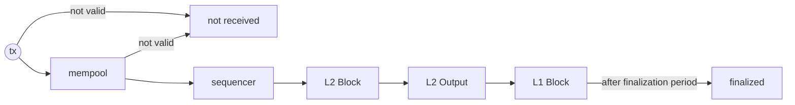

Understanding how the network includes transactions in a block helps you
grasp the blockchain system more deeply. This page explores the step-by-step
lifecycle of a transaction.

## L1 Transaction Lifecycle

1. **Transaction Submission**: When you submit a transaction, it undergoes a
   check_tx process before entering the mempool. If valid, it enters the
   mempool. If invalid, the system returns an error response.
2. **Mempool Validation**: Each transaction must pass the check_tx process
   before the mempool accepts it. After each block, the mempool runs
   recheck_tx on remaining transactions and filters out any that failed due
   to state changes during block execution.
3. **Transaction Propagation to Validators**: Once a transaction enters the
   mempool, all nodes share it through peer-to-peer (p2p) communication.
   This ensures delivery to the block-generating validator.
4. **Block Generation (Execution)**: A chosen validator creates a block from
   the transactions in the mempool, following the CometBFT rules.

## L2 Transaction Lifecycle

1. **Transaction Submission**: When you submit a transaction, it undergoes a
   check_tx process before entering the mempool. If valid, it enters the
   mempool. If invalid, the system returns an error response.
2. **Mempool Validation**: Each transaction must pass the check_tx process
   before the mempool accepts it. After each block, the mempool runs
   recheck_tx on remaining transactions and filters out any that failed due
   to state changes during block execution.
3. **Transaction Propagation to Sequencers**: Once a transaction enters the
   mempool, all nodes share it through peer-to-peer (p2p) communication.
   This ensures delivery to the block-generating sequencer.
4. **Block Generation (Execution)**: The sequencer creates a block from the
   validated transactions.
5. **L2 Output Submission to L1**: After an epoch of blocks, the L2 submits
   the state root to L1 for finalization.
6. **Finalization Period**: A 7-day challenge period for the optimistic rollup.
7. **Finalized**: The final stage where the transaction is confirmed.

