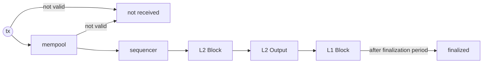

Knowing how the transactions are included in a block can help understand the system of blockchain more deeply. In this document, we will delve in deeper into a step-by-step lifecycle of a transaction. 

## L1 Transaction Lifecycle

1. **Transaction Submission**: When a transaction is submitted, it undergoes a check_tx process before it's allowed into the mempool. If it's valid, it enters the mempool; If it's invalid, an error response is delivered.
2. **Mempool Validation**: A transaction must pass the check_tx process before it's added to the mempool. After each block is created, the mempool performs a recheck_tx on the remaining transactions, filtering out any that failed due to state changes during block execution.
3. **Transaction Propagation to Validators**: Once a transaction successfully enters the mempool, all nodes share the transaction through peer-to-peer (p2p) communication. This ensures delivery to the block-generating validator.
4. **Block Generation (Execution)**: A chosen validator creates a block using the transactions in the mempool, following the cometbft rules.

## L2 Transaction Lifecycle

1. **Transaction Submission**: When a transaction is submitted, it undergoes a check_tx process before it's allowed into the mempool. If it's valid, it enters the mempool. If it's invalid, an error response is delivered.
2. **Mempool Validation**: A transaction must pass the check_tx process before it's added to the mempool. After each block is created, the mempool performs a recheck_tx on the remaining transactions, filtering out any that failed due to state changes during block execution.
3. **Transaction Propagation to Sequencers**: Once a transaction successfully enters the mempool, all nodes share the transaction through peer-to-peer (p2p) communication. This ensures delivery to the block-generating sequencer.
4. **Block Generation (Execution)**: Using the validated transactions, a block is generated.
5. **L2 Output Submission to L1**: After an epoch of blocks is generated, the L2 state root is submitted to L1 for finalization.
6. **Finalization Period**: This is a 7-day period set aside for the challenge period of the optimistic rollup.
7. **Finalized**: This is the final stage where the transaction is confirmed.

