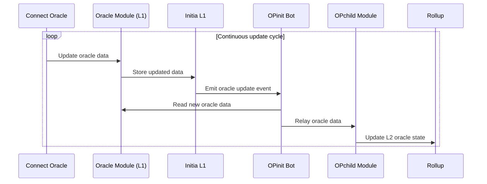

```mermaid
sequenceDiagram
    participant SO as Connect Oracle
    participant ORM as Oracle Module (L1)
    participant IL1 as Initia L1
    participant OPB as OPinit Bot
    participant OPC as OPchild Module
    participant R as Rollup

    loop Continuous update cycle
        SO->>ORM: Update oracle data
        ORM->>IL1: Store updated data
        IL1->>OPB: Emit oracle update event
        OPB->>ORM: Read new oracle data
        OPB->>OPC: Relay oracle data
        OPC->>R: Update L2 oracle state
    end
```
