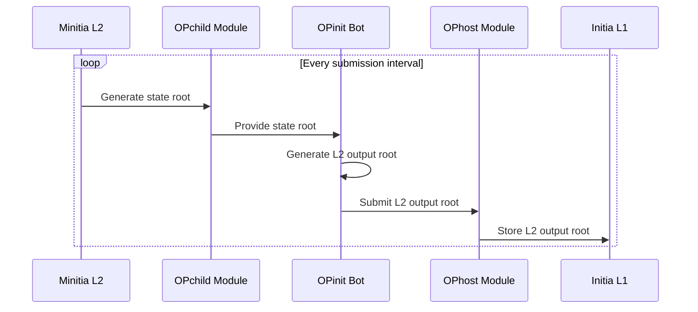

```mermaid
sequenceDiagram
    participant ML2 as Minitia L2
    participant OPC as OPchild Module
    participant OPB as OPinit Bot
    participant OPH as OPhost Module
    participant IL1 as Initia L1

    loop Every submission interval
        ML2->>OPC: Generate state root
        OPC->>OPB: Provide state root
        OPB->>OPB: Generate L2 output root
        OPB->>OPH: Submit L2 output root
        OPH->>IL1: Store L2 output root
    end
```