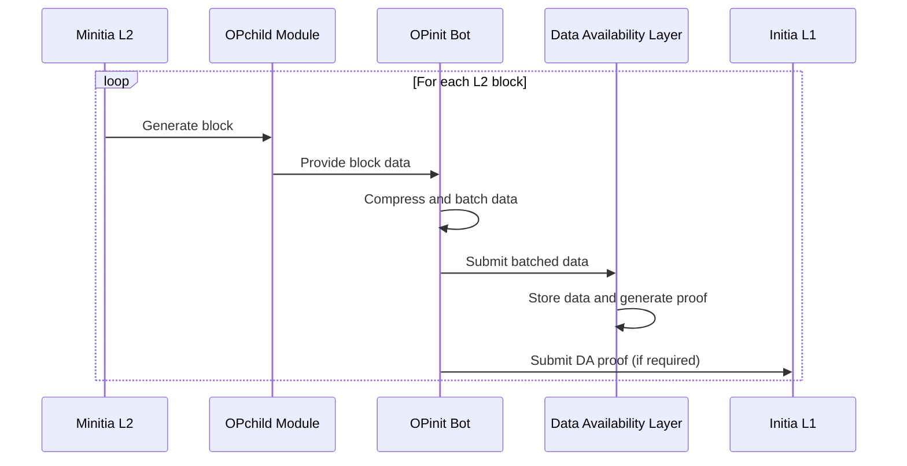

```mermaid
sequenceDiagram
    participant ML2 as Minitia L2
    participant OPC as OPchild Module
    participant OPB as OPinit Bot
    participant DA as Data Availability Layer
    participant IL1 as Initia L1

    loop For each L2 block
        ML2->>OPC: Generate block
        OPC->>OPB: Provide block data
        OPB->>OPB: Compress and batch data
        OPB->>DA: Submit batched data
        DA->>DA: Store data and generate proof
        OPB->>IL1: Submit DA proof (if required)
    end
```