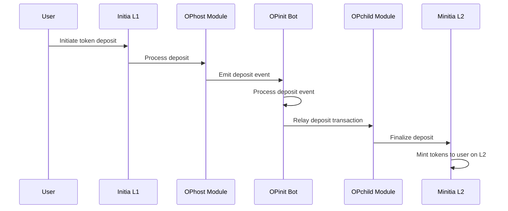
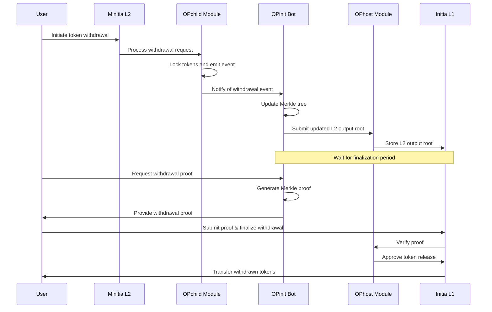

## Token Deposits

The token deposit process begins when a user submits a deposit transaction on the Initia L1 chain. Once the transaction is confirmed, the Bridge Executor retrieves the latest block data (including the deposit) from the L1 node. It then submits a message to the Minitia L2 node to finalize the deposit. After the L2 node confirms the finalized deposit, it mints the corresponding opINIT tokens on the specified Minitia.

### Deposit Sequence

## Token Withdrawals

The token withdrawal process begins when a user submits a withdrawal transaction on the Minitia chain. Once the transaction is confirmed, the Bridge Executor retrieves the latest block data (including the withdrawal) from the L2 node. It then submits a message to the Initia L1 node to finalize the withdrawal. After the L1 node confirms the finalized withdrawal, it burns the corresponding opINIT tokens on the specified Minitia.

The withdrawal then enters a withdrawal period during which the transaction can be challenged and potentially canceled. If no challenge is submitted by the end of this period, the user can claim the withdrawal on Initia L1.

### Withdrawal Sequence

The withdrawal period is designed to allow for a challenge period during which any malicious activity can be detected and addressed. If a challenge is submitted, the withdrawal is canceled. If no challenge is submitted, the transaction is finalized and the tokens are released to the user on Initia L1.