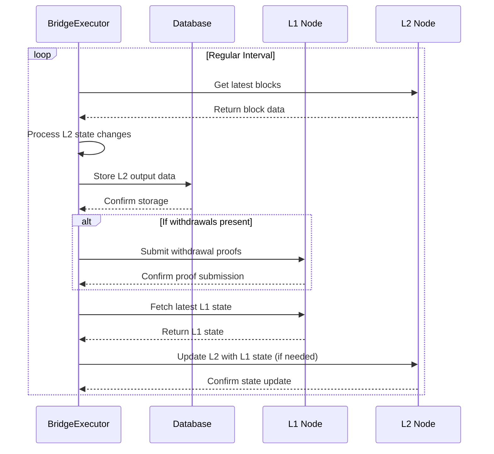

```mermaid
sequenceDiagram
    participant BE as BridgeExecutor
    participant DB as Database
    participant L1 as L1 Node
    participant L2 as L2 Node

    loop Regular Interval
        BE->>L2: Get latest blocks
        L2-->>BE: Return block data
        BE->>BE: Process L2 state changes
        BE->>DB: Store L2 output data
        DB-->>BE: Confirm storage
        alt If withdrawals present
            BE->>L1: Submit withdrawal proofs
            L1-->>BE: Confirm proof submission
        end
        BE->>L1: Fetch latest L1 state
        L1-->>BE: Return L1 state
        BE->>L2: Update L2 with L1 state (if needed)
        L2-->>BE: Confirm state update
    end
```